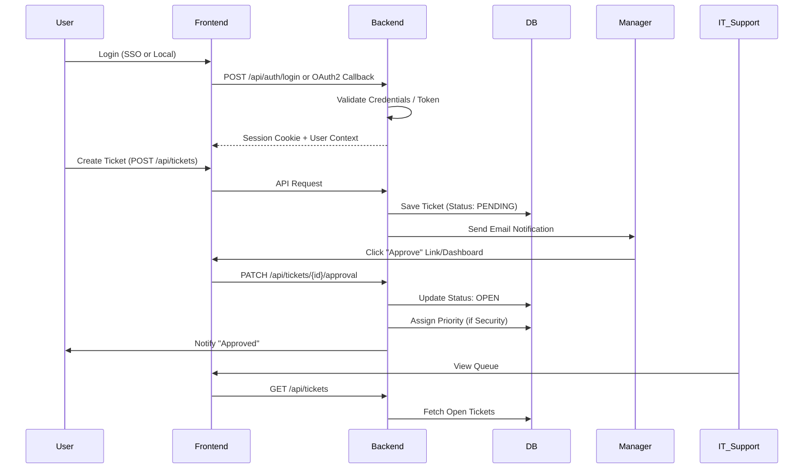
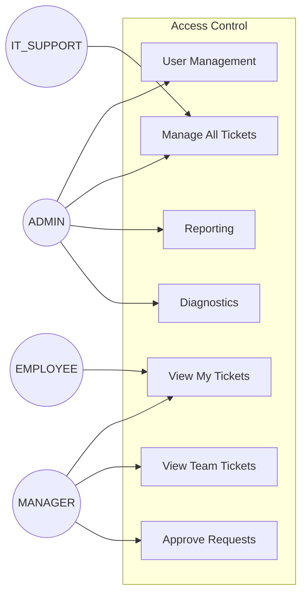

# IT4U Portal Architecture & Development Plan

**Status**: DRAFT  
**Version**: 1.0  
**Date**: Dec 14, 2025  
**Author**: Lead Architect (Antigravity)

---

## 1. Executive Summary

IT4U is the internal IT Service Portal for Geosoft Global, designed to streamline ticket management, asset requests, and IT support workflows. The system replaces legacy email/spreadsheet tracking with a centralized, role-based web application.

**Key capabilities:**
- **Self-Service**: Employees can raise tickets, track status, and view knowledge base articles.
- **Approvals**: Automated manager approval workflows for hardware/access requests.
- **Support Operations**: IT Support dashboards for queue management, assignment, and SLA tracking.
- **Administration**: User management, system reporting, and configuration.

The platform is built on a modern **Spring Boot + React** stack, designed for on-premise deployment with Azure AD SSO integration.

---

## 2. Current System Architecture (As-Is)

The system follows a monolith-first approach with a separated frontend (Single Page Application) served via the backend mechanism in production.

### Tech Stack
- **Frontend**: React 19 (Vite), TailwindCSS 4, Axios, React Router 7.
- **Backend**: Spring Boot 3.3.0, Java 17.
- **Database**: PostgreSQL 14.
- **Security**: Spring Security 6 (OAuth2 + Basic), JWT/Session-based hybrid.

### A) High-Level System Diagram

```mermaid
graph TD
    UserBrowser[User Browser]
    
    subgraph "Internal Network / Server"
        ReverseProxy[IIS / Nginx (Optional)]
        
        subgraph "IT4U Application Server (Port 8060)"
            Static[Static Resources (Frontend Dist)]
            Controller[Spring Boot Controllers]
            Security[Spring Security Filter Chain]
            Service[Business Logic Services]
            JPA[JPA / Hibernate]
        end
        
        DB[(PostgreSQL Database)]
    end
    
    subgraph "External Cloud Services"
        AzureAD[Microsoft Entra ID (SSO)]
        SMTP[Microsoft 365 SMTP]
    end

    UserBrowser -->|HTTPS| ReverseProxy
    ReverseProxy -->|HTTP| Security
    Security -->|Serve UI| Static
    Security -->|API Requests| Controller
    Controller --> Service --> JPA --> DB
    Security -.->|OIDC| AzureAD
    Service -.->|SMTP| SMTP
```

### B) Request Flow Diagram



### C) RBAC Diagram



---

## 3. Portal Modules

### 3.1 Employee Portal
**Objective**: Self-service for end-users.
- **Features**:
    - **Dashboard**: View "My Tickets" (Open/Closed).
    - **Create Ticket**: Form with Category (Hardware, Software, Access, etc.), Priority (Hidden/Auto), Description, Attachments.
    - **Ticket Details**: View history, add comments, upload files.
- **Key APIs**:
    - `POST /api/tickets`
    - `GET /api/tickets/my` (Security: filtered by `requester_id`)
    - `POST /api/tickets/{id}/comments`

### 3.2 Manager Portal
**Objective**: Oversight and approvals.
- **Features**:
    - **Approval Dashboard**: List of tickets requiring approval (`PENDING_MANAGER_APPROVAL`).
    - **Team View**: View tickets raised by direct reports (`GET /api/tickets/approvals`).
    - **Action**: Approve or Reject requests.
- **Key APIs**:
    - `GET /api/tickets/approvals?managerId={id}`
    - `PATCH /api/tickets/{id}/approval`

### 3.3 IT Support Portal
**Objective**: Issue resolution and queue management.
- **Features**:
    - **Global Queue**: View all tickets filtered by status/priority.
    - **Assignment**: Assign tickets to self or other IT staff.
    - **Work Management**: Update status (IN_PROGRESS, RESOLVED, WAITING_FOR_USER), add internal notes.
- **Key APIs**:
    - `GET /api/tickets` (Role: IT_SUPPORT/ADMIN)
    - `PATCH /api/tickets/{id}/assign`
    - `PATCH /api/tickets/{id}/status`

### 3.4 Admin Portal
**Objective**: System configuration and strategic oversight.
- **Features**:
    - **User Management**: Create/Edit users, reset passwords, sync LDAP (future).
    - **Reporting**: Exportable data for audits.
    - **System Health**: View logs, diagnostics, and email audit trails.
- **Key APIs**:
    - `GET /api/admin/users`
    - `GET /api/admin/reports`
    - `GET /api/admin/reports`
    - `GET /api/admin/email-audit`
    - `GET /api/admin/notifications` (New: Live notification log)

### 3.5 Production Test Mode
**Objective**: Safe verification in production.
- **Features**:
    - **Isolation**: When `IT4U_TEST_MODE=true`, users get `qa_` prefix and tickets get `QA-PROD-` prefix.
    - **Auth**: `NoOpPasswordEncoder` enabled to allow legacy/test credentials (`admin_test` / `password`).
    - **Safety**: Admin UI allows cleanup of test data.

---

## 4. Technical Architecture Detail

### 4.1 Backend (Spring Boot)
- **Controller Layer**: RESTful endpoints (`com.gsg.it4u.controller`).
- **Service Layer**: Business logic, transaction management.
- **Data Layer**: Spring Data JPA repositories.
- **Config**:
    - `SecurityConfig.java`: Role hierarchy and endpoint protection.
    - `application-prod.properties`: Externalized config for DB and SMTP.

### 4.2 Frontend (React + Vite)
- **Routing**: `react-router-dom` v7 with `RoleRedirector` for context-aware landing pages.
- **State Management**: Context API (`AuthContext`, `ThemeContext`).
- **API Client**: Centralized Axios instance with interceptors for 401 handling.
- **Styling**: TailwindCSS for utility-first design, supporting dark mode variables (`var(--bg-page)`).

### 4.3 Database Design (PostgreSQL)
Key Tables:
- `users`: Stores credentials (bcrypt), roles, and manager relationships.
- `tickets`: Core entity with `status`, `approval_status`, `sla_deadline`.
- `attachments`: Stores file metadata (actual files on disk/blob).
- `service_nodes`: Infrastructure inventory for basic monitoring.

### 4.4 Authentication & SSO
- **Primary**: Azure AD (OIDC) for general users.
- **Failover/Admin**: Local database authentication (`BCryptPasswordEncoder`).
- **Logic**: `AuthController` determines login method based on `auth_provider` or `created_by_admin` flags.

---

## 5. Security & Risk Management

### 5.1 Authorization Strategy
- **Endpoint Security**: Explicit `requestMatchers` in `SecurityConfig`.
    - `/api/users/**` -> ADMIN only.
    - `/api/tickets` (GET) -> IT/Manager/Admin.
- **Data Security**:
    - `TicketController` filters `/my` endpoint by the authenticated user's ID.
    - **Risk**: Attachments download currently relies on obscure URLs. Needs stricter ownership check implementation.

### 5.2 Risks & Mitigation Plan

| Risk | Impact | Mitigation Strategy |
|------|--------|---------------------|
| **SSO Failure** | User lockout | Maintained "Need-Glass" admin account with local password login. |
| **Punt-to-localhost** | PROD UI fails | Fixed `apiClient.js` to use relative paths; `deploy_prod.ps1` sets `VITE_API_URL=""`. |
| **IDOR on Files** | Data leak | Implement checking `ticket.requester.id == current_user.id` in `AttachmentController`. |
| **Slow Reports** | Timeout | `ReportController` uses `InputStreamResource` for streaming response (Implemented). |

---

## 6. Reporting Module Specification

**Current Implementation**:
- **Endpoint**: `/api/admin/reports/tickets`
- **Output Formats**: JSON (UI), Excel (`.xlsx`), CSV (`.csv`).
- **Filters**:
    - Date Range (Start/End)
    - Status (OPEN, RESOLVED, etc.)
    - Manager (ID)
    - Assigned IT Staff
- **UI**: `ReportsPage.jsx` provides a dedicated dashboard with real-time grid view and export buttons.

---

## 7. Deployment Architecture

### Development
- **Frontend**: `npm run dev` (Port 5173, Proxy to 8080).
- **Backend**: `mvn spring-boot:run` (Port 8080, Profile: dev).

### Production
- **Strategy**: "Fat JAR" deployment. Frontend is built and embedded into Backend.
- **Build Process** (`deploy_prod.ps1`):
    1. `npm run build` (Output: `dist`).
    2. Copy `dist/*` to `backend/src/main/resources/static`.
    3. `mvn package` (Output: `it4u-1.4.0.jar`).
- **Run Command**:
    ```powershell
    java -jar it4u-1.4.0.jar --spring.profiles.active=prod --server.port=8060
    ```
- **Environment Variables**:
    - `MAIL_PASSWORD`: For SMTP auth.
    - `DB_PASSWORD`: For PostgreSQL.

---

## 8. Development Roadmap

### Phase 1: Stabilization (Current)
- [x] Fix PROD authentication loops.
- [x] Standardize API client and error handling.
- [x] Implement initial Reporting Module.
- [/] **Action**: Complete E2E regression suite for all roles.

### Phase 2: Security & Hardening
- [ ] **Secure Attachments**: Add ownership validation to download endpoints.
- [ ] **Rate Limiting**: Prevent brute-force on `/api/auth/login`.
- [ ] **Audit Logging**: Track "Who changed what" for Ticket status changes.

### Phase 3: Advanced Features
- [ ] **SLA Engine**: Auto-calculate deadlines based on Priority maps.
- [ ] **Knowledge Base**: Expand simple article table to full search/rendering.
- [ ] **SMS Notifications**: Integrate Twilio for critical alerts (Server Down).

### Phase 4: Enterprise Scale
- [ ] **LDAP/AD Sync**: Auto-provision users from Active Directory.
- [ ] **Asset Management**: Full inventory system linked to tickets.

---

## 9. Testing Strategy

### Manual Verification
- **Login**: Verify both Local Admin and SSO User.
- **Flow**: Create Ticket (Employee) -> Approve (Manager) -> Resolve (IT).
- **Reports**: Generate Excel report and verify dates match input.

### Automated Testing
- **E2E (Playwright)**: `full-regression.spec.ts`
    - Runs against DEV (`localhost:5173`) and PROD (`localhost:8060`).
    - Covers: Login, Routing, Ticket Creation, Admin Access Control.
- **Unit Tests**:
    - `TicketControllerTest`: Logic validation.
    - `SecurityConfigTest`: URL access rules.

### Definition of Done (DoD)
1. Code compiles without warnings.
2. E2E Regression Pass (11/11 tests).
3. Build script `deploy_prod.ps1` runs successfully.
4. No high-severity security issues (Sonar/Manual check).

---
