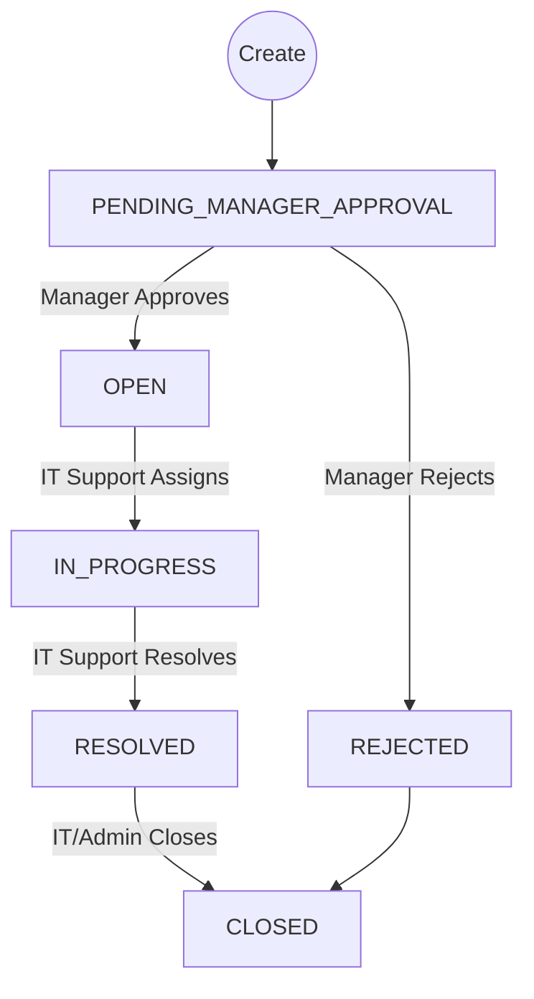

# Ticket Lifecycle & Flows

## Status Flow Diagram

## Permission Matrix

| Action              | Role: EMPLOYEE | Role: MANAGER | Role: IT_SUPPORT             | Role: ADMIN | Rules / Constraints |
| :------------------ | :------------- | :------------ | :--------------------------- | :---------- | :------------------ |
| **Create Ticket**   | ✅             | ✅            | ✅                           | ✅          | Cannot create for others unless Admin |
| **Add Comment**     | ✅             | ✅            | ✅                           | ✅          | Public comments visible to all |
| **Upload File**     | ✅             | ✅            | ✅                           | ✅          | Max 2MB, no Executables |
| **Approve/Reject**  | ❌             | ✅            | ❌                           | ❌          | Only designated manager can act |
| **Assign Ticket**   | ❌             | ❌            | ✅                           | ✅          | Must verify IT Support availability |
| **Set IN_PROGRESS** | ❌             | ❌            | ✅                           | ✅          | **Requires Manager Approval first** |
| **Resolve Ticket**  | ❌             | ❌            | ✅ (Owner only)              | ✅          | **Must be assigned to Actor** |
| **Close Ticket**    | ❌             | ❌            | ✅ (Owner only)              | ✅          | Final state, read-only |

## Critical Logic Rules
1.  **Manager Gate:** A ticket cannot move to `IN_PROGRESS`, `RESOLVED`, or `CLOSED` until `managerApprovalStatus` is `APPROVED`.
2.  **IT Ownership:** An IT Support user cannot Resolve or Close a ticket unless they are the `assignedTo` user. Admins can override this.
3.  **Self-Assignment:** IT Support users can self-assign tickets that are `OPEN`.
